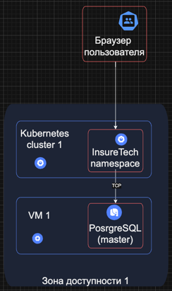
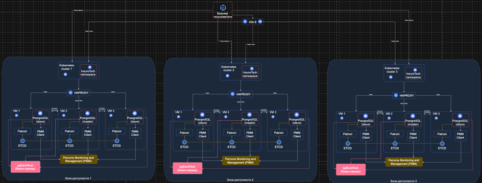

# Проектирование технологической архитектуры

## Постановка проблемы и требования
Компания хочет сделать упор на развитие в регионах РФ.
Планируется значительный рост количества пользователей и запросов.
Нужно обеспечить бесперебойную работу сервиса 24/7, при этом сервис должен обслуживать клиентов из всех часовых поясов.

Требования к отказоустойчивости системы крайне высокие: RTO — 45 мин., RPO — 15 мин.
Согласно требованиям бизнеса, доступность приложения должна быть равна 99,9%.

Дополнительно к этому нужно обеспечить одинаковое время загрузки страниц для пользователей из разных регионов.
Оно не должно зависеть от географического местоположения пользователя.

На текущий момент сервис хранит ограниченный набор данных, который включает в себя:
- базовую информацию о клиентах — ФИО, контакты, документы,
- информацию о продуктах и тарифах,
- историю заявок клиентов.

Общий объём данных, которые хранятся в системе, равен 50 GB.

## Технологические решение

Для того, что бы требования были выполнены, необходимо использовать фейловер-стратегию.
Данная стратегия нацелена на повышении доступности и отказоустойчивости приложения.

На мой взгляд, в данном случае лучше всего использовать стратегию Active-Active с георезервированием.
Тк в данной стратегии все кластеры приложения работают параллельно, и в случае сбоя в одном кластере, 
весь трафик будет равномерна распределен между другими кластерами.
За счет данной технологии и будет гарантирована доступность приложения 99,9%.

Так же, не менее важный аспект, это георезервирование. 
Тк компания хочет расширяться по всей территории РФ и обеспечить одинаковое время загрузки контента сайта из разный регионов, то необходимо однозначно разворачивать приложение в интересующих нас регионов РФ. Что бы обеспечить минимальный отклик наших клиентов во время использования сайта.

Так же, в этом еще есть дополнительное преимущество. Мы не будем зависеть конкретно от одного цода. Да, цоды тоже могут быть недоступны, по тем или иным причинам. И если по каким-то причинам цод недоступен, тем самым наше приложения именно в этом цоде не будет отвечать. Но весь трафик пойдет в другое приложение, которое будет располагаться в другом цоде.

Со фейловер-стратегией разобрались, как приложение будет располагаться, так же разобрались, далее идет база данных PostgeSQL.
Из поставленной задачи мы видим, что мы ожидаем значительный рост клиентов в приложении, так же данное приложение хранит в себе базовую информацию о клиентах, информацию о продуктах, тарифах и тд. И очевидно, что приложении использует эту информацию для своей работы.

Для того6 что бы база данных не стала нашим узким горлышком, необходимо заранее подготовить ее к нагрузке. В данном случае будем использовать классическую схему master – slave. Кластер с master будут идти запросы на запись, а в кластеры slave на чтение. Тем самым мы сможет оптимизировать нагрузку на базу данных.
А для обеспечения надежности, будем использовать Patroni — это шаблон конфигурации, который позволяет добиться высокой доступности и отказоустойчивости распределённого кластера PostgreSQL. Он состоит из нескольких компонентов:
- Узлы PostgreSQL, которые также могут быть геораспределены.
- Кластер etcd — хранилище распределённой конфигурации, в котором находится состояние кластера PostgreSQL.
- HAProxy — балансировщик нагрузки для кластера и единая точка входа для клиентских приложений.
- pgBackRest — решение для резервного копирования и восстановления для PostgreSQL.
- Percona Monitoring and Management (PMM) — решение для мониторинга работоспособности вашего кластера.

Каждый экземпляр PostgreSQL в кластере поддерживает согласованность с другими узлами посредством потоковой репликации. Каждый экземпляр включает в себя Patroni — менеджер кластера, который отслеживает работоспособность кластера.

В будущем, так же можно будет подключить кэш, чтобы еще сильнее оптимизировать работу приложения. И повысить отклик работы сайта для клиентов. Но в данном случае это пока что не требуется.

Для наглядности, отобразим все изменения с помощью схемы в draw io.

Текущая схема:

[InsureTech_технологическая_архитектура-as-is.drawio.xml](InsureTech_%D1%82%D0%B5%D1%85%D0%BD%D0%BE%D0%BB%D0%BE%D0%B3%D0%B8%D1%87%D0%B5%D1%81%D0%BA%D0%B0%D1%8F_%D0%B0%D1%80%D1%85%D0%B8%D1%82%D0%B5%D0%BA%D1%82%D1%83%D1%80%D0%B0-as-is.drawio.xml)

Целевая схема:

[InureTech_технологическая архитектура_to-be.xml](InureTech_%D1%82%D0%B5%D1%85%D0%BD%D0%BE%D0%BB%D0%BE%D0%B3%D0%B8%D1%87%D0%B5%D1%81%D0%BA%D0%B0%D1%8F%20%D0%B0%D1%80%D1%85%D0%B8%D1%82%D0%B5%D0%BA%D1%82%D1%83%D1%80%D0%B0_to-be.xml)
