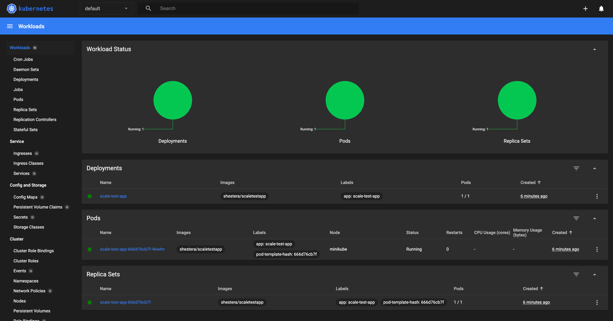
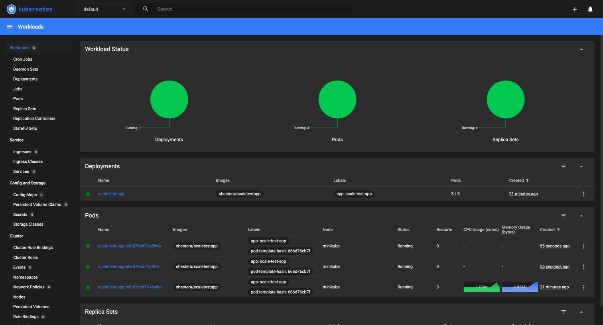
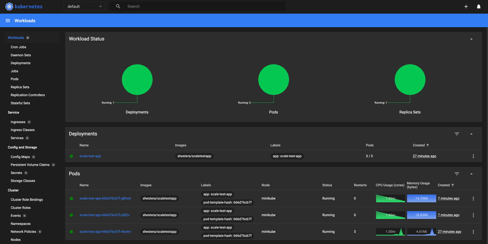
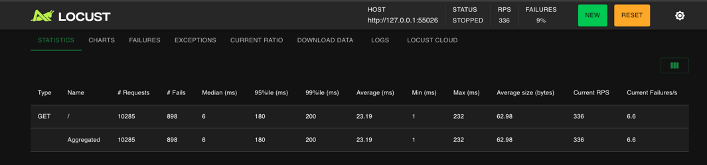
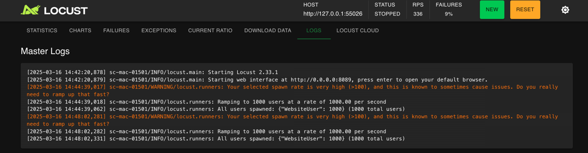

# Динамическое масштабирование контейнеров

## Постановка проблемы и требования
Сейчас сервисы InsureTech развёрнуты в Kubernetes. Каждый из них развёрнут в определённом количестве экземпляров.

Обычно этих экземпляров достаточно для успешной обработки всех запросов. Но в периоды пиковой нагрузки система не справляется: она демонстрирует нестабильное поведение и постоянно перезагружает поды из-за нехватки памяти. Как следствие, пользователи получают негативный опыт работы с приложением. Бизнес видит, что NPS снижается.

Можно, конечно, держать больше реплик постоянно активными, чтобы система могла справиться с пиковыми нагрузками. Но это экономически невыгодно и приведёт к низким показателям утилизации ресурсов. Таким образом, вам необходимо решить проблему с помощью конфигурации динамического масштабирования для сервисов компании.

Вы будете тестировать динамическое масштабирование на примере простого приложения. Оно предоставляет два ресурса:
GET / — получение идентификатора пода;
GET /metrics — получение метрик в формате Prometheus.

Метрика http_requests_total возвращает количество запросов для метода получения идентификатора пода.

Образ тестового приложения. Оба метода приложения доступны по порту 8080.

## Технологические решение
Манифест развёртывания (Deployment) Kubernetes для запуска приложения:
```yaml
apiVersion: apps/v1
kind: Deployment
metadata:
  name: scaletestapp
  labels:
    app: scaletestapp
spec:
  selector:
    matchLabels:
      app: scaletestapp
  template:
    metadata:
      labels:
        app: scaletestapp
    spec:
      containers:
        - name: scaletestapp
          image: shestera/scaletestapp
          ports:
            - containerPort: 8080
          resources:
            requests:
              memory: "20Mi"
            limits:
              memory: "30Mi"

```
[deployment.yaml](deployment.yaml)

Манифест сервиса (Service) для доступа к приложению:
```yaml
apiVersion: v1
kind: Service
metadata:
  name: scaletestapp-service
spec:
  type: NodePort
  selector:
    app: scaletestapp
  ports:
    - protocol: TCP
      port: 8080
      targetPort: 8080
      nodePort: 30000
```
[service.yaml](service.yaml)

Манифест на динамическую маршрутизацию на основании показателей утилизации оперативной памяти с помощью Horizontal Pod Autoscaler (HPA)Ж
```yaml
apiVersion: autoscaling/v2
kind: HorizontalPodAutoscaler
metadata:
  name: scaletestapp-hpa
spec:
  scaleTargetRef:
    apiVersion: apps/v1
    kind: Deployment
    name: scaletestapp
  minReplicas: 1
  maxReplicas: 10
  metrics:
    - type: Resource
      resource:
        name: memory
        target:
          type: Utilization
          averageUtilization: 80
```
[hpa.yaml](hpa.yaml)

Запуск команды minikube dashboard до нагрузки:


После:


Как видно на скриншоте, в связи с нагрузкой поднялись 2 дополнительных пода.

Locust запускался с данными настройками:
- Number of users (peak concurrency) = 1000
- Ramp up (users started/second) = 1000

Логи Locust:


